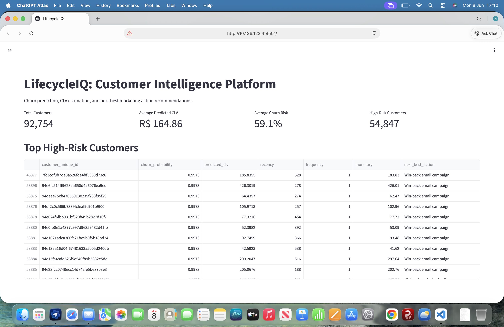
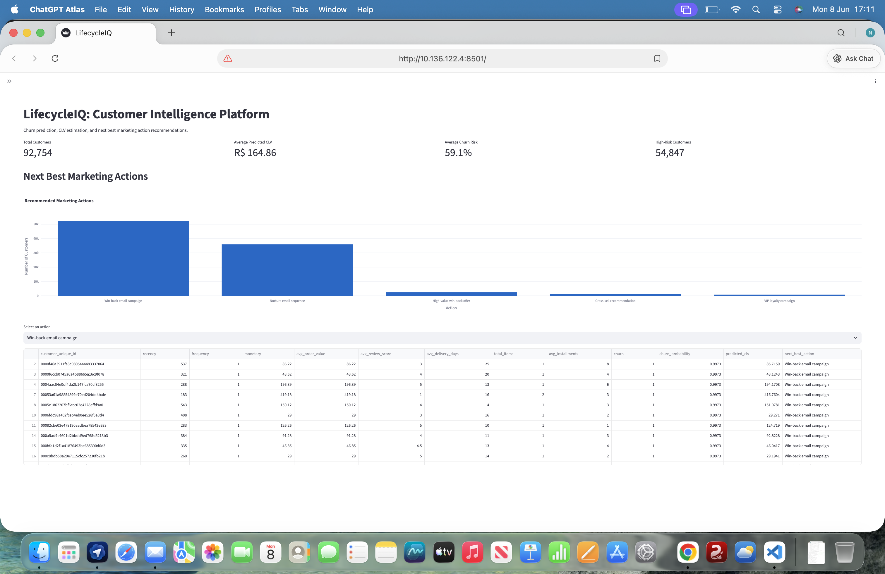
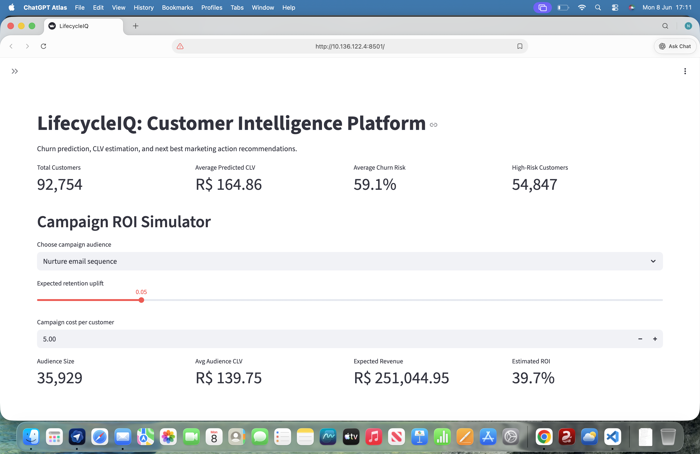
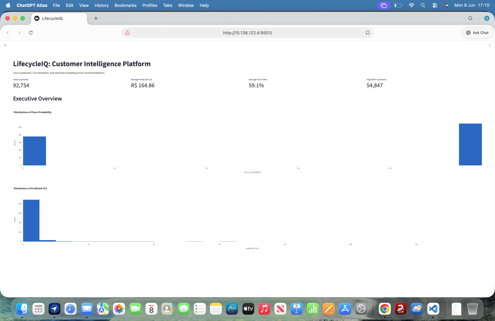
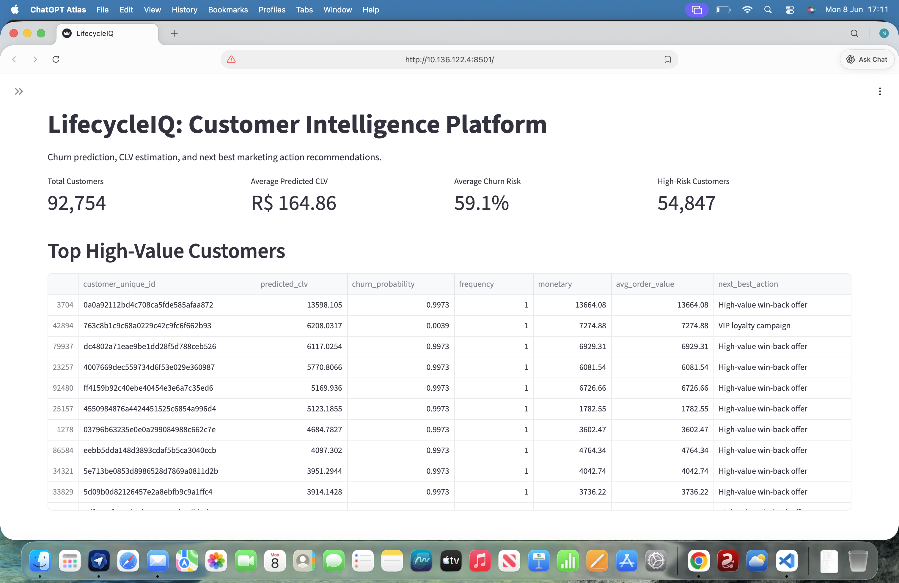
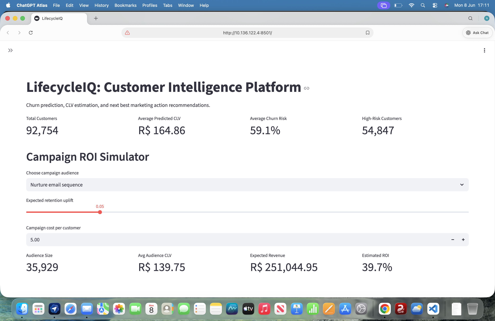

# LifecycleIQ: Customer Intelligence Platform

## Live Demo

<<<<<<< HEAD
**Streamlit App:**
https://nehafinmath-lifecycleiq-dashboardapp-ow9fyu.streamlit.app/

---

## Overview

LifecycleIQ is an end-to-end MarTech customer intelligence platform designed to help marketing teams identify high-risk customers, estimate customer lifetime value (CLV), recommend next-best actions, and simulate campaign ROI.

Inspired by customer analytics systems used at HubSpot, Braze, Klaviyo, and Salesforce, the platform combines machine learning with marketing analytics to support lifecycle marketing decisions.
=======
🚀 Streamlit App:

https://nehafinmath-lifecycleiq-dashboardapp-ow9fyu.streamlit.app/

---

## Overview

LifecycleIQ is an end-to-end MarTech customer intelligence platform designed to help marketing teams identify customers likely to churn, estimate customer lifetime value (CLV), recommend next-best marketing actions, and simulate campaign ROI.

Inspired by modern CRM and marketing analytics systems used at HubSpot, Braze, Klaviyo, and Salesforce.
>>>>>>> bed57d2 (Improved README and screenshots)

---

# Business Problem

<<<<<<< HEAD
Marketing teams need to answer several important questions:
=======
Marketing teams need to answer:
>>>>>>> bed57d2 (Improved README and screenshots)

* Which customers are likely to churn?
* Which customers generate the highest value?
* Which customers should receive retention campaigns?
<<<<<<< HEAD
* Which marketing action should be taken for each customer?
* What is the expected return on a campaign?
=======
* Which marketing action should be taken?
* What is the expected return on investment?
>>>>>>> bed57d2 (Improved README and screenshots)

LifecycleIQ addresses these questions using machine learning and customer-level behavioral features.

---

# Dataset

**Source:** Olist Brazilian E-Commerce Public Dataset

<<<<<<< HEAD
The dataset contains:
=======
Contains:
>>>>>>> bed57d2 (Improved README and screenshots)

* Customer information
* Orders
* Payments
* Reviews
* Products

<<<<<<< HEAD
Approximately:
=======
Dataset size:
>>>>>>> bed57d2 (Improved README and screenshots)

* 92,754 customers
* 100k+ orders

---

<<<<<<< HEAD
# Project Architecture
=======
# Architecture
>>>>>>> bed57d2 (Improved README and screenshots)

```text
Raw Olist Data
        ↓
Feature Engineering
        ↓
Customer Feature Dataset
        ↓
Churn Prediction Model
        ↓
CLV Prediction Model
        ↓
Next Best Action Engine
        ↓
Campaign ROI Simulator
        ↓
Streamlit Dashboard
```

---

# Feature Engineering

<<<<<<< HEAD
Customer-level features engineered:
=======
Customer-level features:
>>>>>>> bed57d2 (Improved README and screenshots)

### Behavioral Features

* Recency
* Frequency
* Monetary value

### Transaction Features

* Average order value
* Total items purchased
* Average payment installments

### Experience Features

* Average review score
* Average delivery days

### Target Variables

#### Churn

Customer inactive for more than 180 days.

<<<<<<< HEAD
#### Customer Lifetime Value (Proxy)

Total monetary value generated by the customer.
=======
#### Customer Lifetime Value

Historical monetary value used as a CLV proxy.
>>>>>>> bed57d2 (Improved README and screenshots)

---

# Machine Learning Models

## Churn Prediction

### Model

XGBoost Classifier

### Features

* Recency
* Frequency
* Monetary value
* Average order value
* Review score
* Delivery days
* Total items
* Payment installments

### Output

Probability of customer churn.

---

## Customer Lifetime Value Prediction

### Model

XGBoost Regressor

<<<<<<< HEAD
### Target

Customer monetary value proxy.

### Output

Predicted CLV for each customer.
=======
### Output

Predicted customer lifetime value.
>>>>>>> bed57d2 (Improved README and screenshots)

---

## Next Best Action Engine

<<<<<<< HEAD
A rule-based recommendation engine assigns marketing actions based on churn probability and predicted CLV.
=======
Rule-based recommendation engine.
>>>>>>> bed57d2 (Improved README and screenshots)

Actions include:

* High-value win-back offer
* Win-back email campaign
* VIP loyalty campaign
* Cross-sell recommendation
* Nurture email sequence

---

# Model Performance

## CLV Model

| Metric | Value |
| ------ | ----- |
| MAE    | 4.62  |
| RMSE   | 57.72 |
| R²     | 0.935 |

---

<<<<<<< HEAD
# Dashboard

The Streamlit dashboard contains:
=======
# Dashboard Screenshots

## Executive Overview


---

## Churn Risk Analysis



---

## CLV Analysis


---

## Next Best Action Engine



---

## Campaign ROI Simulator



---

# Dashboard Features
>>>>>>> bed57d2 (Improved README and screenshots)

### Executive Overview

* Total customers
<<<<<<< HEAD
* Average predicted CLV
* Average churn risk
=======
* Average CLV
* Churn risk
>>>>>>> bed57d2 (Improved README and screenshots)
* High-risk customers

### Churn Risk Explorer

<<<<<<< HEAD
Identify customers most likely to churn.
=======
Identify customers likely to churn.
>>>>>>> bed57d2 (Improved README and screenshots)

### CLV Analysis

Identify high-value customers.

### Next Best Action Recommendations

Recommend personalized marketing actions.

### Campaign ROI Simulator

Estimate:

<<<<<<< HEAD
* Audience size
* Campaign costs
* Expected retained revenue
* Expected ROI

### Customer-Level Table

Explore customer predictions.

---

# Dashboard Screenshots

## Executive Overview



---

## Churn Risk Analysis


---

## CLV Analysis



---

## Next Best Action Engine


---

## Campaign ROI Simulator


=======
* Campaign audience size
* Expected revenue
* Campaign cost
* Estimated ROI
>>>>>>> bed57d2 (Improved README and screenshots)

---

# Technology Stack

## Programming

* Python

## Data Analysis

* Pandas
* NumPy

## Machine Learning

* Scikit-Learn
* XGBoost

## Visualization

* Plotly
* Matplotlib
* Seaborn

## Dashboard

* Streamlit

<<<<<<< HEAD
## Serialization

* Joblib

=======
## Model Serialization

* Joblib

## Querying

* SQL

>>>>>>> bed57d2 (Improved README and screenshots)
## Version Control

* Git
* GitHub

<<<<<<< HEAD
## Querying

* SQL

=======
>>>>>>> bed57d2 (Improved README and screenshots)
---

# Project Structure

```text
LifecycleIQ
│
├── dashboard
│     └── app.py
│
├── data
│     ├── raw
│     └── processed
│
├── images
│
├── models
│     ├── churn_model.pkl
│     └── clv_model.pkl
│
├── notebooks
│     └── 01_EDA.ipynb
│
├── sql
│     └── customer_features.sql
│
├── src
│     ├── feature_engineering.py
│     ├── train_models.py
│     ├── next_best_action.py
│     └── segmentation.py
│
├── README.md
├── requirements.txt
└── .gitignore
```

---

# How To Run

<<<<<<< HEAD
Clone the repository:
=======
Clone repository:
>>>>>>> bed57d2 (Improved README and screenshots)

```bash
git clone https://github.com/nehafinmath/LifecycleIQ.git
```

<<<<<<< HEAD
Move into the project:
=======
Move into project:
>>>>>>> bed57d2 (Improved README and screenshots)

```bash
cd LifecycleIQ
```

Create virtual environment:

```bash
python3 -m venv venv
```

Activate environment:

```bash
source venv/bin/activate
```

Install dependencies:

```bash
pip install -r requirements.txt
```

Run feature engineering:

```bash
python3 src/feature_engineering.py
```

Train models:

```bash
python3 src/train_models.py
```

Generate next-best actions:

```bash
python3 src/next_best_action.py
```

Launch dashboard:

```bash
streamlit run dashboard/app.py
```

---

# Business Impact

LifecycleIQ enables marketing teams to:

* Identify customers likely to churn.
* Prioritize retention campaigns.
* Estimate customer lifetime value.
* Recommend personalized marketing actions.
* Simulate campaign ROI.
* Support CRM and lifecycle marketing decisions.

---

# Limitations

* Public data does not contain campaign exposure information.
* Next-best-action recommendations are rule-based.
<<<<<<< HEAD
* CLV target is a proxy based on historical monetary value.
* No real-time customer events are available.
=======
* CLV target is a proxy based on historical spending.
* No real-time event data is available.
>>>>>>> bed57d2 (Improved README and screenshots)

---

# Future Improvements

* Customer segmentation with RFM + KMeans
* Uplift modeling
<<<<<<< HEAD
* A/B testing framework
* Campaign attribution models
* Docker deployment
* MLflow experiment tracking
* FastAPI inference service
* Cloud deployment on AWS
* Real-time customer event ingestion
=======
* A/B testing
* Marketing attribution
* Docker deployment
* MLflow experiment tracking
* FastAPI API service
* AWS deployment
* Real-time customer events
>>>>>>> bed57d2 (Improved README and screenshots)

---

# Author

**Neha**

MSc Financial Mathematics
<<<<<<< HEAD
=======

>>>>>>> bed57d2 (Improved README and screenshots)
Interested in:

* Marketing Data Science
* Customer Analytics
* Product Analytics
* Growth Analytics
* Machine Learning

<<<<<<< HEAD
GitHub: https://github.com/nehafinmath

---
=======
GitHub:

https://github.com/nehafinmath
>>>>>>> bed57d2 (Improved README and screenshots)
