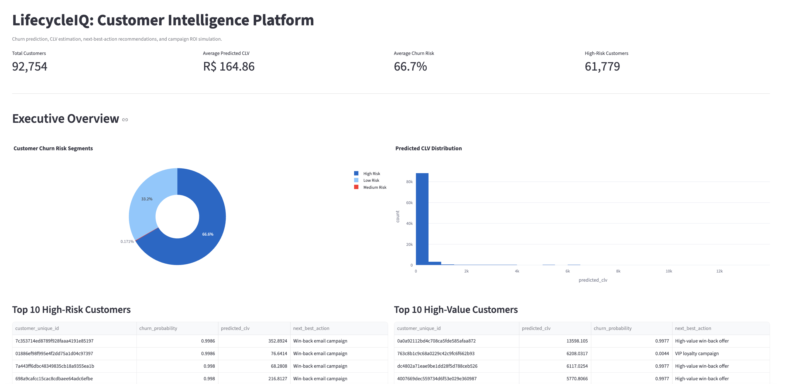
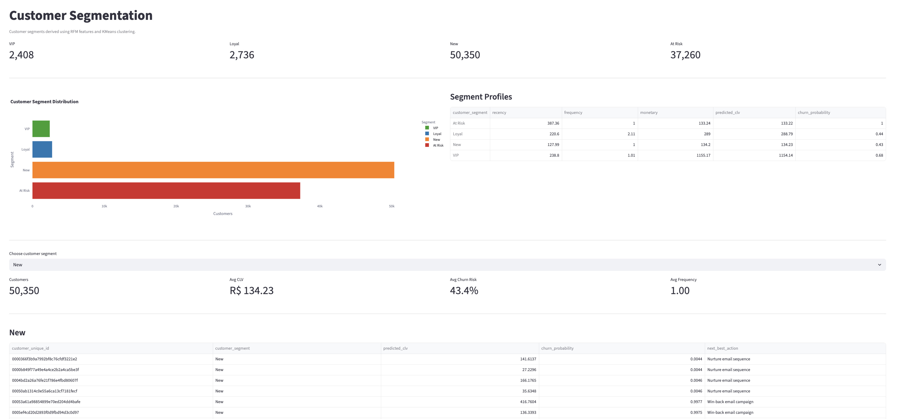
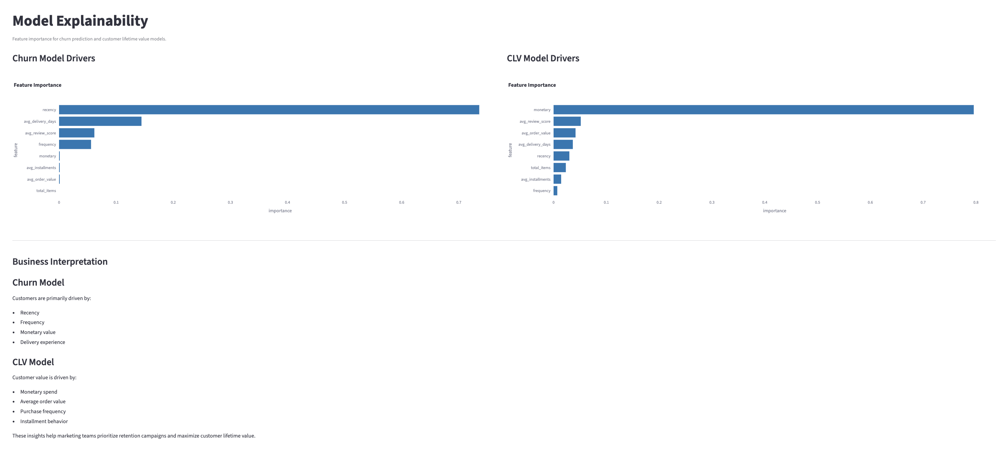
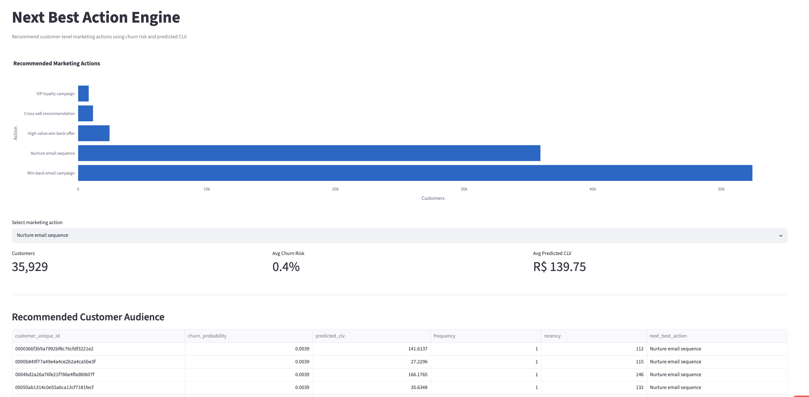
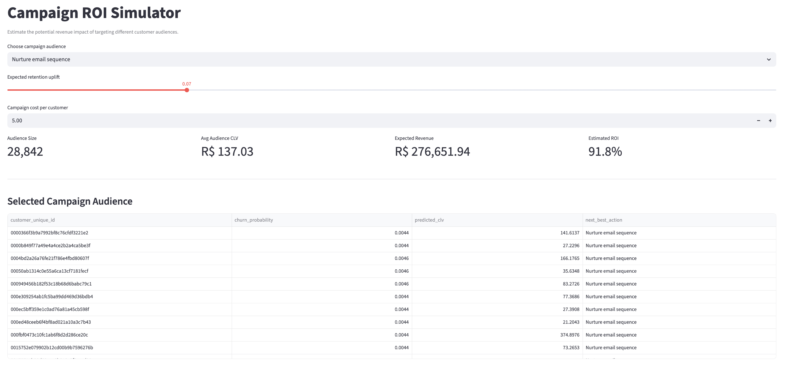

# LifecycleIQ: Customer Intelligence Platform

## 🚀 Live Demo

**Streamlit App**

https://nehafinmath-lifecycleiq-dashboardapp-ow9fyu.streamlit.app/

---

# Overview

LifecycleIQ is an end-to-end MarTech customer intelligence platform that predicts customer churn, estimates customer lifetime value (CLV), recommends next-best actions, and simulates campaign ROI.

Inspired by customer analytics systems used at HubSpot, Braze, Klaviyo, and Salesforce, the platform combines machine learning and marketing analytics to support lifecycle marketing decisions.

---

# Business Problem

Marketing teams need to answer several important questions:

* Which customers are likely to churn?
* Which customers generate the highest value?
* Which customers should receive retention campaigns?
* Which marketing action should be taken for each customer?
* What is the expected return on investment?

LifecycleIQ helps answer these questions using customer-level behavioral and transactional data.

---

# Dataset

**Source:** Olist Brazilian E-Commerce Public Dataset

Contains:

* Customer information
* Orders
* Payments
* Reviews
* Products

Dataset size:

* 92,754 customers
* 100k+ orders

---

# Architecture

```text
Raw Olist Data
        ↓
Feature Engineering
        ↓
Customer Feature Dataset
        ↓
Churn Prediction Model
        ↓
CLV Prediction Model
        ↓
Next Best Action Engine
        ↓
Campaign ROI Simulator
        ↓
Streamlit Dashboard
```

---

# Feature Engineering

### Behavioral Features

* Recency
* Frequency
* Monetary value

### Transaction Features

* Average order value
* Total items purchased
* Average payment installments

### Customer Experience Features

* Average review score
* Average delivery days

### Target Variables

#### Churn

Customer inactive for more than 180 days.

#### Customer Lifetime Value

Historical monetary value used as a CLV proxy.

---

# Machine Learning Models

## Churn Prediction

### Model

XGBoost Classifier

## Features

- Churn Prediction using XGBoost
- Customer Lifetime Value Prediction
- Customer Segmentation using KMeans
- Next Best Action Engine
- Campaign ROI Simulator
- Model Explainability
- Interactive Streamlit Dashboard

### Output

Probability of customer churn.

---

## Customer Lifetime Value Prediction

### Model

XGBoost Regressor

### Output

Predicted customer lifetime value.

---

## Next Best Action Engine

Rule-based recommendation engine.

Marketing actions:

* High-value win-back offer
* Win-back email campaign
* VIP loyalty campaign
* Cross-sell recommendation
* Nurture email sequence

---

# Model Performance

## CLV Model

| Metric | Value |
| ------ | ----- |
| MAE    | 4.62  |
| RMSE   | 57.72 |
| R²     | 0.935 |

---


# Dashboard Screenshots

## Executive Overview

<p align="center">
  
</p>

---

## Customer Segmentation

<p align="center">
  
</p>

---

## Model Explainability

<p align="center">
  
</p>

---

## Next Best Action Engine

<p align="center">
  
</p>

---

## Campaign ROI Simulator

<p align="center">
  
</p>


# Dashboard Features

### Executive Overview

* Total customers
* Average predicted CLV
* Average churn probability
* High-risk customers

### Churn Risk Explorer

Identify customers most likely to churn.

### CLV Analysis

Identify high-value customers.

### Next Best Action Recommendations

Recommend personalized marketing actions.

### Campaign ROI Simulator

Estimate:

* Audience size
* Expected retained revenue
* Campaign cost
* Expected ROI

---

# Technology Stack

### Programming

* Python

### Data Analysis

* Pandas
* NumPy

### Machine Learning

* Scikit-Learn
* XGBoost

### Visualization

* Plotly
* Matplotlib
* Seaborn

### Dashboard

* Streamlit

### Model Storage

* Joblib

### Querying

* SQL

### Version Control

* Git
* GitHub

---

# Project Structure

```text
LifecycleIQ
│
├── dashboard
│     └── app.py
│
├── data
│     ├── raw
│     └── processed
│
├── images
│
├── models
│     ├── churn_model.pkl
│     └── clv_model.pkl
│
├── notebooks
│     └── 01_EDA.ipynb
│
├── sql
│     └── customer_features.sql
│
├── src
│     ├── feature_engineering.py
│     ├── train_models.py
│     ├── next_best_action.py
│     └── segmentation.py
│
├── README.md
├── requirements.txt
└── .gitignore
```

---

# How To Run

Clone repository:

```bash
git clone https://github.com/nehafinmath/LifecycleIQ.git
```

Move into project:

```bash
cd LifecycleIQ
```

Create environment:

```bash
python3 -m venv venv
```

Activate:

```bash
source venv/bin/activate
```

Install packages:

```bash
pip install -r requirements.txt
```

Feature engineering:

```bash
python3 src/feature_engineering.py
```

Train models:

```bash
python3 src/train_models.py
```

Generate next-best actions:

```bash
python3 src/next_best_action.py
```

Launch dashboard:

```bash
streamlit run dashboard/app.py
```

---

# Business Impact

LifecycleIQ enables marketing teams to:

* Identify customers likely to churn.
* Prioritize retention campaigns.
* Estimate customer lifetime value.
* Recommend personalized marketing actions.
* Simulate campaign ROI.
* Support CRM and lifecycle marketing decisions.

---

# Limitations

* Public data does not contain campaign exposure information.
* Next-best-action recommendations are rule-based.
* CLV target is based on historical spending.
* No real-time event stream is available.

---

# Future Improvements

* Customer segmentation using RFM + KMeans
* Uplift modeling
* A/B testing
* Marketing attribution models
* Docker deployment
* MLflow experiment tracking
* FastAPI inference API
* AWS deployment
* Real-time customer event ingestion

---

# Author

**Neha**

MSc Financial Mathematics

Interested in:

* Marketing Data Science
* Customer Analytics
* Product Analytics
* Growth Analytics
* Machine Learning

GitHub:

https://github.com/nehafinmath
